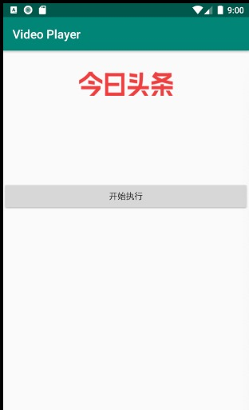
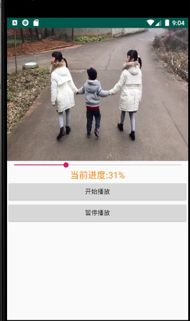

##README
####个人信息：
16071070 陈泽寅

####Demo说明
一：功能说明：

1.PPT上的要求，并且实现旋转功能，主页面如下，点击开始执行按钮进入视频播放页面。

2.视频播放页面主要由三部分构成，最上面的就是我们的视频播放部分，中间是进度条，我们可以左右拖动进度条，然后就能将视频进行快进或后退，然后在进度条下方会返回当前进度。按暂停播放，视频就会暂停，按开始播放视频重新从暂停的地方开始播放。

旋转页面后，视频不会从头开始播放，而是从原来的进度上继续播放。

@copyright 16071070 czy